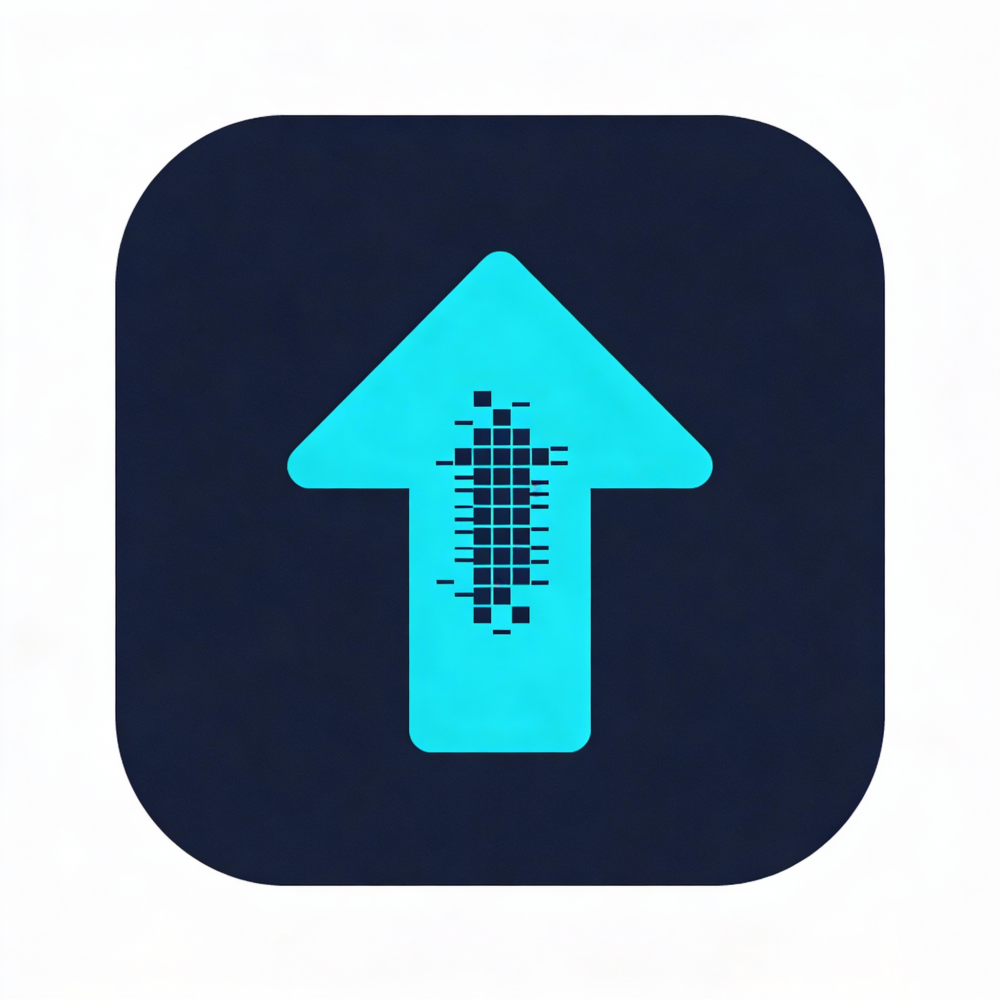

<div align="center">
  
</div>


# 🚀 Rustatio

A modern, cross-platform BitTorrent ratio management tool that emulates popular torrent clients. Built with Rust for blazingly fast performance and Tauri for a native desktop/mobile experience.

Accurately simulate seeding behavior by emulating **uTorrent**, **qBittorrent**, **Transmission**, or **Deluge** with customizable upload/download rates and tracker interactions.

> [!IMPORTANT]
> This tool is for **educational purposes only**. Manipulating upload/download statistics on BitTorrent trackers may violate the terms of service of private trackers and could result in account suspension or ban. Use at your own risk.

## 🎥 Demo

[https://github.com/takitsu21/rustatio/assets/demo.mp4](https://github.com/user-attachments/assets/e07d1177-3a29-4865-a7f5-0ebbaecdd038)

## 📸 Screenshots

<table>
  <tr>
    <td width="50%">
      
      <p align="center"><em>Light Theme - Main Interface</em></p>
    </td>
    <td width="50%">
      
      <p align="center"><em>Dark Theme - Main Interface</em></p>
    </td>
  </tr>
  <tr>
    <td width="50%">
      
      <p align="center"><em>Torrent Loaded with Statistics</em></p>
    </td>
    <td width="50%">
      
      <p align="center"><em>Active Torrent with Performance Charts</em></p>
    </td>
  </tr>
</table>

## ✨ Features

- **Modern GUI**: Beautiful, intuitive interface built with Tauri and Svelte
- **Cross-platform**: Works on Linux, Windows, and macOS
- **Multi-Instance Support**: Manage multiple torrents simultaneously with tabbed interface
- **Popular Client Emulation**: Spoofs uTorrent, qBittorrent, Transmission, and Deluge
- **Automatic Tracker Detection**: Reads tracker URL directly from torrent file
- **Real-time Statistics**: Live updates of upload/download stats and ratio
- **Performance Analytics**: Interactive charts for upload/download rates and peer distribution
- **TOML Configuration**: Easy-to-edit configuration file
- **Console Logging**: Detailed logging for debugging

## 🚀 Getting Started

Rustatio is available in **three versions**:

- **🖥️ Desktop App** - Native application with full features, no CORS limitations
- **🐳 Docker** - Self-hosted server version, accessible via web UI from any device
- **🌐 Web App** - Browser-based version, works on any device, deployable to GitHub Pages

### Desktop App Installation

**Windows**

1. Download the latest setup installer from [Releases](https://github.com/takitsu21/rustatio/releases)
2. Run the installer and follow the installation wizard
3. Launch Rustatio from the Start Menu

**macOS**

1. Download the latest `Rustatio_*.dmg` file from [Releases](https://github.com/takitsu21/rustatio/releases) 
2. Open the downloaded file and drag Rustatio to your Applications folder 
3. Launch Rustatio from Applications (you may need to allow it in System Preferences → Security & Privacy)

**Linux**

Download from [Releases](https://github.com/takitsu21/rustatio/releases)

Debian/Ubuntu:

```bash
sudo apt install ./Rustatio_*.deb
```

Fedora/RHEL/CentOS:

```bash
sudo dnf install Rustatio-*.rpm
```

AppImage (Universal):

```bash
chmod +x Rustatio_*.AppImage && ./Rustatio_*.AppImage
```

### Docker (Self-Hosted)

Run Rustatio on your server, NAS, or any Docker-enabled system. The web UI is accessible from any device on your network.

**Quick Start with Docker Compose**

1. Create a `docker-compose.yml` file:

```yaml
services:
  rustatio:
    image: ghcr.io/takitsu21/rustatio:latest
    container_name: rustatio
    environment:
      - PORT=8080
      - RUST_LOG=${RUST_LOG:-info}
    ports:
      - "${WEBUI_PORT:-8080}:8080"  # Web UI port
    volumes:
      - rustatio_data:/data
    restart: unless-stopped

volumes:
  rustatio_data:
```

2. Start the container:

```bash
docker compose up -d
```

3. Access the web UI at `http://localhost:8080` (or your server's IP)

**Custom Port Configuration**

To change the web UI port, use the `WEBUI_PORT` environment variable or change the default port.

**Using Docker Run**

```bash
# Default port 8080
docker run -d -p 8080:8080 --name rustatio ghcr.io/takitsu21/rustatio:latest

# Custom port 3000
docker run -d -p 3000:8080 --name rustatio ghcr.io/takitsu21/rustatio:latest
```

**Running Behind a VPN (Recommended)**

For privacy, route all tracker requests through a VPN using [gluetun](https://github.com/qdm12/gluetun):

```yaml
services:
  gluetun:
    image: qmcgaw/gluetun
    cap_add:
      - NET_ADMIN
    devices:
      - /dev/net/tun:/dev/net/tun
    environment:
      # Configure your VPN provider - see https://github.com/qdm12/gluetun-wiki
      - VPN_SERVICE_PROVIDER=protonvpn  # or: mullvad, nordvpn, expressvpn, etc.
      - VPN_TYPE=wireguard              # or: openvpn
      # Provider-specific settings (example for ProtonVPN WireGuard)
      - WIREGUARD_PRIVATE_KEY=${WIREGUARD_PRIVATE_KEY}
      - SERVER_COUNTRIES=${SERVER_COUNTRIES:-Switzerland}
    ports:
      - "${WEBUI_PORT:-8080}:8080"  # Rustatio Web UI
    restart: unless-stopped

  rustatio:
    image: ghcr.io/takitsu21/rustatio:latest
    container_name: rustatio
    # Run as non-root user (UID/GID 1000 by default, matches Dockerfile)
    user: "${PUID:-1000}:${PGID:-1000}"
    environment:
      - PORT=8080
      - RUST_LOG=${RUST_LOG:-info}
    volumes:
      - rustatio_data:/data
    restart: unless-stopped
    network_mode: service:gluetun
    depends_on:
      gluetun:
        condition: service_healthy

volumes:
  rustatio_data:
```

To customize the web UI port with VPN:

```bash
WEBUI_PORT=3000 docker compose up -d
```

> **Note**: The `ports` are defined on the `gluetun` container since Rustatio uses its network stack. See the [gluetun wiki](https://github.com/qdm12/gluetun-wiki) for VPN provider-specific configuration.

**Docker Features**:
- ✅ No CORS limitations (server handles tracker requests)
- ✅ Runs on any Docker-enabled system (Linux, Windows, macOS, NAS)
- ✅ Multi-architecture support (amd64, arm64)

### Web App Usage

**Live Demo**: [https://takitsu21.github.io/rustatio/](https://takitsu21.github.io/rustatio/)

The web version runs entirely in your browser using WebAssembly. 

⚠️ **CORS Setup Required**: Most BitTorrent trackers don't allow browser requests. You'll need to set up a free CORS proxy (takes 5 minutes).

📖 **[Complete Setup Guide](WEB_VERSION.md)** - Step-by-step instructions for setting up your free Cloudflare Workers CORS proxy

**Features compared to Desktop**:
- ✅ Same core functionality (ratio faking, client emulation)
- ✅ Works on any device with a modern browser
- ✅ No installation required
- ✅ Session persistence via localStorage
- ⚠️ Requires CORS proxy for most trackers

## 📖 Usage (Desktop & Web)

1. **Select Torrent**: Click "Select Torrent File" and choose your .torrent file
2. **Configure Settings**:
   - Choose which client to emulate
   - Set upload/download rates (KB/s)
   - Set initial completion percentage
   - Configure port and other options
3. **Start Faking**: Click "Start" to begin
4. **Monitor Stats**: Watch real-time statistics update every seconds
5. **Stop**: Click "Stop" when done

## ⚙️ Configuration

Configuration is automatically saved when using the UI. Settings are stored in:

- **Linux/macOS**: `~/.config/rustatio/config.toml`
- **Windows**: `%APPDATA%\rustatio\config.toml`

You can also manually edit the configuration file. Example configuration:

```toml
[client]
default_type = "qbittorrent"
default_port = 6881
default_num_want = 50

[faker]
default_upload_rate = 50.0
default_download_rate = 100.0
default_announce_interval = 1800
update_interval = 5

[ui]
window_width = 1200
window_height = 800
dark_mode = true
```

## 🎯 Supported Clients

- **uTorrent** (default: 3.5.5)
- **qBittorrent** (default: 5.1.4)
- **Transmission** (default: 4.0.5)
- **Deluge** (default: 2.1.1)

Each client is accurately emulated with proper:

- Peer ID format
- User-Agent headers
- HTTP protocol version
- Query parameter ordering

## 🔧 How It Works

1. **Torrent Parsing**: Reads .torrent file and extracts info_hash and tracker URL
2. **Client Spoofing**: Generates authentic-looking peer ID and key for selected client
3. **Tracker Announce**: Sends periodic announces to tracker with fake stats
4. **Stat Accumulation**: Simulates upload/download based on configured rates
5. **Real-time Updates**: Updates statistics and re-announces at tracker-specified intervals

**For Users:**
- 📖 [**WEB_VERSION.md**](WEB_VERSION.md) - How to use the web version and set up CORS proxy (5 minute guide)

## 🤝 Contributing

Contributions are welcome! Please feel free to submit a Pull Request.

## 📜 License

MIT License - see LICENSE file for details

## 🙏 Credits

- Inspired by [RatioMaster.NET](https://github.com/NikolayIT/RatioMaster.NET)
- Built with [Tauri](https://tauri.app/), [Svelte 5](https://svelte.dev/), [Tailwind CSS](https://tailwindcss.com/), and [shadcn-svelte](https://www.shadcn-svelte.com/)

## Differences from RatioMaster.NET

- **Modern Stack**: Rust + Tauri instead of C# + WinForms
- **Cross-platform**: Native support for Linux, Windows, macOS
- **Simplified UI**: Focus on essential features with clean design
- **Better Performance**: Async/await throughout, efficient resource usage
- **Modern Config**: TOML instead of Windows Registry
