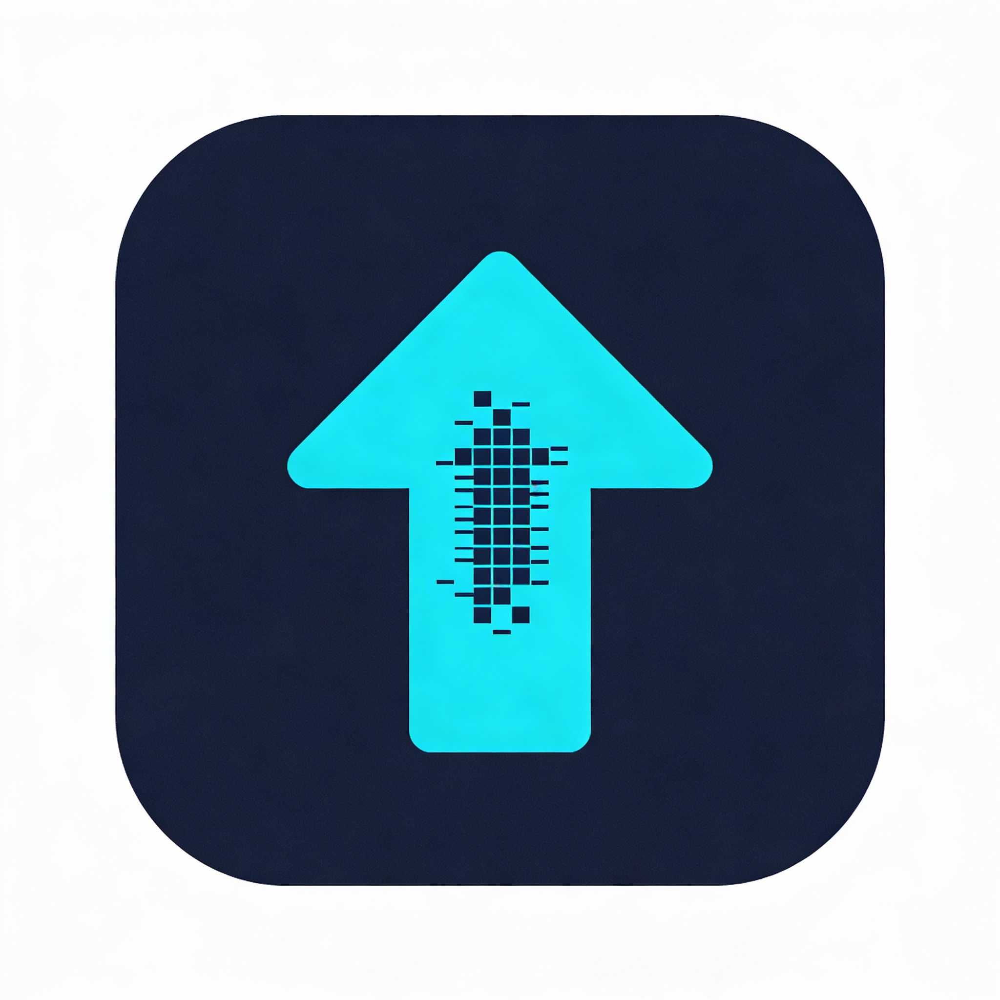

<div align="center">
  
</div>

```yaml
services:
  gluetun:
    image: qmcgaw/gluetun
    cap_add:
      - NET_ADMIN
    devices:
      - /dev/net/tun:/dev/net/tun
    environment:
      # Configure your VPN provider - see https://github.com/qdm12/gluetun-wiki
      - VPN_SERVICE_PROVIDER=protonvpn  # or: mullvad, nordvpn, expressvpn, etc.
      - VPN_TYPE=wireguard              # or: openvpn
      # Provider-specific settings (example for ProtonVPN WireGuard)
      - WIREGUARD_PRIVATE_KEY=${WIREGUARD_PRIVATE_KEY}
      - SERVER_COUNTRIES=${SERVER_COUNTRIES:-Switzerland}
      # Gluetun control server auth (v3.39.1+ defaults to private routes)
      # If you want to have your network status available you have to disable the gluetun auth
      # Since the control server is only reachable within the container network namespace it is safe
      - HTTP_CONTROL_SERVER_AUTH_DEFAULT_ROLE={"auth":"none"}
    ports:
      - "${WEBUI_PORT:-8080}:8080"  # Rustatio Web UI
    restart: unless-stopped

  rustatio:
    image: ghcr.io/takitsu21/rustatio:latest
    entrypoint: ["/entrypoint.sh"]
    container_name: rustatio
    environment:
      - PORT=8080
      - RUST_LOG=${RUST_LOG:-trace}
      - PUID=${PUID:-1000}
      - PGID=${PGID:-1000}
      # Optional authentication for your server (Recommended if exposing on internet)
      # - AUTH_TOKEN=${AUTH_TOKEN:-CHANGE_ME}
    volumes:
      - /your/path/to/entrypoint.sh:/entrypoint.sh:ro
      - /your/path/to/rustatio_daemon.sh:/rustatio_daemon.sh:ro
      - rustatio_data:/data
      # Optional: Uncomment to enable watch folder feature
      # - ${TORRENTS_DIR:-./torrents}:/torrents
    restart: unless-stopped
    network_mode: service:gluetun
    depends_on:
      gluetun:
        condition: service_healthy

volumes:
  rustatio_data:
```
